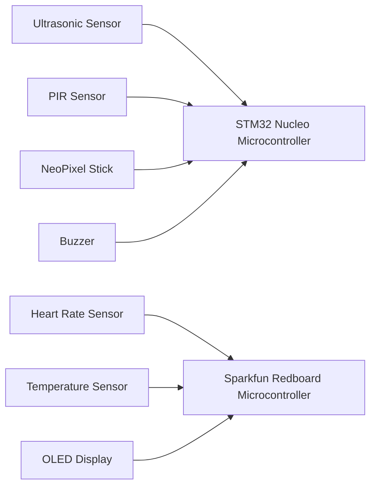

# iHat Pro

Name: Yufei Wang(YWE9002), Juyang Bai(JBY3704), Yicong Wang(YWW7426)

## Project Overview

Keeping social distance is important to protect ourselves and others during the COVID-19 pandemic. Recently, there is a new variant called Omicron, which appears to be spreading more than twice as quickly as Delta. However, people usually don't realize that they are staying too close to others. Meanwhile, it’s hard for them to know they are infected if they just have mild symptoms. So we plan to design a smart hat that can measure data like distance, body temperature, and heart rate, and notify the user about the risk of infection. And if someone has mild symptoms, the hat will alert others to keep a secure distance from him. This work not only could help people to think about some wearable devices used to reduce the spread of the epidemic, but also stimulate people to explore more potential applications of wearable technology.

## Project Design

Since one microcontroller is not providing enough power for all of the components, we use two boards to connect them. The ultrasonic sensors, the PIR sensors, the NeoPixel Sticks, and the buzzer are connected to the STM32 Nucleo board. The heart rate sensor, the temperature sensor, and the OLED screen are connected to the Sparkfun RedBoard.

## Project Implementation

### Hardware Connection

Each ultrasonic sensor requires 2 digital pins, one for triggering ultrasonic waves, and the other for receiving the echo. The buzzer is also connected to the digital pin of the board. The PIR sensors and the NeoPixel Sticks are connected to the analog pins. The heartbeat sensor, the temperature sensor, and the OLED display need to communicate with Sparkfun RedBoard using I2C. So all of them connect to SCL and SCK pins using wire.

### Software Design

#### Distance Detecting

At the beginning of the setup, we set a one-minute delay to let the PIR sensor calibrate. The NeoPixel Sticks will first light up in green color. The ultrasonic sensor’s output pin will first be set to low, then the output pin will be high for 10ms to launch the ultrasonic wave. The distance is calculated using the duration times the speed of sound.

Distance = Speed * Time / 2

in which speed is the speed of sound and the time is the duration time. If the distance of the object is within 100cm and the PIR sensor’s signal is high, the LEDs will turn red and the buzzer will beep.

### Health Monitoring

We set up all the parameters of the heartbeat sensor, the temperature sensor, and the OLED display in the setup function. 

- Set up the address of the OLED display and clear the buffer of RAM. 
- Set up the I2C port and I2C speed and initialize the heartbeat sensor with default values. 
- Initialize the temperature sensor with default values.

To calculate the heart rate, we need to determine if a finger is put on the sensor, which means the immediate IR value is higher than the threshold we set. If the finger is detected by the sensor, then we can calculate the heartbeat per minute using the function

beatPerMinute = 60 / (delta/1000.0)

in which delta is the interval time that the sensor detects the finger. And we read the temperature using functions from the library of the sensor. After getting the data of heart rate and temperature from sensors, we display them on the OLED display using the display function from the library of OLED.

### Component List

| Name                      | Count |
| ------------------------- | ----- |
| STM32 Nucleo              | 1     |
| Sparkfun RedBoard         | 1     |
| Ultrasonic Sensor         | 4     |
| PIR Sensor                | 4     |
| NeoPixel Stick            | 4     |
| Heartbeat Sensor MAX30501 | 1     |
| Temperature Sensor Si7021 | 1     |

## Result Demo

### Distance Detecting

#### Safe Distance

When the PIR sensors don't detect any moving people around or the Ultrasonic sensors detect the distance is far than the threshold, the NeoPixel Sticks light up in green Color. 

 

#### Dangerous Distance

When the PIR sensors detect people moving around and the distance which Ultrasonic sensors detect is smaller than the threshold, the NeoPixel Sticks light up in red Color and the Buzzer would beep.

 

#### Health Monitoring

The OLED would display the heart rate and temperature in real-time.

  

## Future Work

- Even though we achieved the functions we have proposed previously, the sensors we chose were unstable, especially the PIR sensor. Each PIR sensor has two knobs that adjust the detecting sensitivity and range. However, it’s very difficult to quantify the amount of change being made when we turn the knobs. So the motion detection of our sensors is not very stable. We think it may be helpful to use multiple PIR sensors in each direction or to choose a different model.
- During our testing process, we found that one microcontroller can’t provide enough power for all of the components. If we power all of the instruments using a single board, the NeoPixel Sticks will consume too much power and two ultrasonic sensors will not work. To solve this problem, we use an additional board to power the OLED display, the heart rate sensor, and the temperature sensor.
- Due to a tight budget and the chaos during the pandemic, we didn’t get the optimal temperature sensor. The sensor we finally used was for measuring the temperature of the environment. So the measurement of body temperature of our project is not accurate. We think by getting the sensor that we were expecting, the temperature measurement should be accurate.
